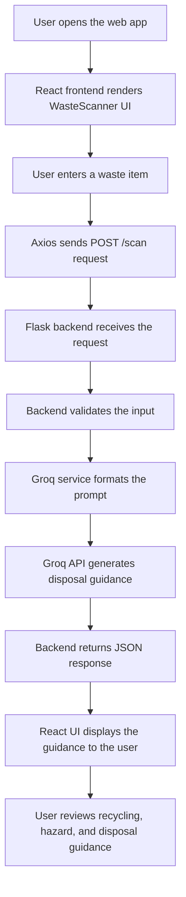

# Architecture Documentation

## 1. Project Overview

This project is a web-based sustainability assistant that helps users identify waste items and receive practical disposal guidance. The application combines a React-based frontend with a Flask backend and an AI-powered response layer powered by the Groq API.

### Purpose
The application aims to make waste sorting easier for everyday users by providing clear recommendations on disposal, recycling, hazard warnings, and environmentally friendly alternatives.

### Problem Statement
Many people are unsure how to dispose of waste correctly. Confusion around recycling rules, hazardous materials, and eco-friendly practices can lead to improper disposal and environmental harm.

### Objective
The primary objective is to provide an intuitive, accessible experience where a user can enter a waste item and receive immediate guidance on how to handle it responsibly.

### Target Users
The application is intended for:
- general household users
- students and educators
- sustainability-conscious individuals
- small organizations interested in waste awareness

## 2. Technology Stack

### Frontend
- React: user interface rendering and component-based interaction
- Vite: development server and build tooling
- Axios: HTTP client for communication with the backend

### Backend
- Python: server-side application logic
- Flask: REST API framework
- Flask CORS: enables cross-origin requests from the frontend

### AI
- Groq API: external AI service used to generate waste guidance
- Llama model: large language model used for content generation

### Configuration
- python-dotenv: loads environment variables from configuration files

### Version Control
- Git: source control
- GitHub: repository hosting and collaboration

## 3. Folder Structure

```text
Sustainable-Waste-Management-Assistant/
├── app.py
├── config.py
├── index.html
├── package.json
├── package-lock.json
├── README.md
├── requirements.txt
├── vite.config.js
├── public/
│   ├── favicon.svg
│   └── icons.svg
├── services/
│   ├── __init__.py
│   └── groq_service.py
├── src/
│   ├── App.css
│   ├── App.jsx
│   ├── index.css
│   ├── main.jsx
│   ├── assets/
│   │   ├── hero.png
│   │   ├── react.svg
│   │   └── vite.svg
│   ├── components/
│   │   └── WasteScanner.jsx
│   └── services/
│       └── api.js
└── docs/
    ├── Architecture.md
    ├── DeploymentValidation.md
    └── Conclusion.md
```

### Folder Purpose
- public/: static assets served by the frontend application
- services/: Python service layer containing AI integration logic
- src/: React application source files
- src/components/: reusable UI components such as the waste scanner interface
- src/services/: frontend service modules for backend communication
- docs/: project documentation and validation artifacts

## 4. System Architecture

The following Mermaid diagram provides a visual preview of the application workflow from user interaction to AI-generated disposal guidance.



The architecture is intentionally simple and lightweight. The frontend collects user input, the backend processes the request, and the AI service generates disposal guidance that is returned to the user.

## 5. Component Architecture

### Frontend Components
- App.jsx: entry component that renders the main waste scanner interface
- WasteScanner.jsx: contains the input field, scan button, and response display
- api.js: central Axios client configured to call the backend

### Backend Components
- app.py: defines the Flask routes and request handling flow
- config.py: loads configuration settings such as API keys from environment variables
- groq_service.py: wraps the Groq client and formats the request to the AI service

## 6. Request Flow

1. The user enters a waste item in the web interface.
2. The React component captures the input value.
3. Axios sends a POST request to the Flask backend.
4. Flask receives the request and validates the incoming payload.
5. The backend calls the Groq service with the user input.
6. The Groq API returns an AI-generated waste guidance response.
7. The backend sends the result back as JSON.
8. The frontend displays the guidance for the user.

## 7. API Architecture

### Endpoints

| Method | Endpoint | Description |
| --- | --- | --- |
| GET | / | Returns a welcome message |
| GET | /health | Returns a basic health response |
| POST | /scan | Accepts a waste item and returns generated guidance |

### Request and Response Details

#### GET /
- Request: none
- Response: JSON welcome message
- Status codes: 200

#### GET /health
- Request: none
- Response: JSON health status message
- Status codes: 200

#### POST /scan
- Request: JSON body containing an item field
- Example body: {"item": "plastic bottle"}
- Response: JSON containing the original item and generated guide text
- Status codes: 200 on success, 400 for missing input, 500 for server-side issues

## 8. Security

- Environment Variables: sensitive values such as API keys are expected to be stored in environment variables.
- API Key Storage: the Groq key is read from configuration rather than being embedded directly in source code.
- dotenv: used to load environment-based values into the application configuration.
- CORS: enabled to allow requests from the frontend origin during local development.
- Input Validation: the backend checks whether an item value is present before processing the request.

## 9. Scalability

The current application is suitable for a small-scale prototype. Future enhancements could include:
- user authentication and personalization
- persistent history of scanned items
- database storage for analytics and records
- image upload and visual waste recognition
- cloud deployment and containerization
- caching for repeated requests
- improved error handling and monitoring
